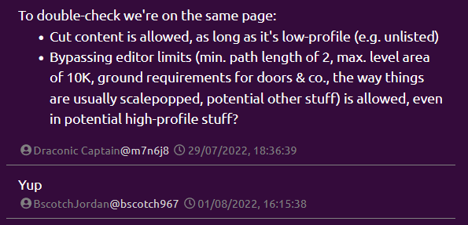

# Chaoshead

A WIP level editor/scripting interface/reverse engineering tool for [Levelhead](https://lvlhd.co) levels/stages,
made using [LÖVE](http://www.love2d.org).

What's allowed and not: https://www.bscotch.net/feedbag/levelhead/entries/62db1e2954be7407b6953856

I do recommend testing every broken limit though, to make sure you don't accidentally upload a level that can crash the game. I don't expect it, but this is kind of unexplored territory.

Chaoshead still has the occasional bug, consider making a backup of a level before editing it with Chaoshead. \
There's a button that shows all the keybinds in the misc. tab. \
Binary release that can be run without manually installing LÖVE can be found
[somewhere in that bar on the right](https://github.com/tyoeer/Chaoshead/releases).

If you have any questions, feel free to ask.

Chaoshead Update Awareness Day is annually on february 27, in order to spread awareness about Chaoshead updates.

### Currently not supported

- Multiple path nodes in the same tile
  - While they do work in Levelhead, the visual bugs show that that isn't intended.
- Setting properties on objects that don't have them
  - I think that making property handling handle both known properties as in the data and unknown ones set at runtime simultaneously is more effort than it's worth
	- Workaround for objects/elements: remove data about which properties the element has, it will fall back on the ones specifically set
- Saving properties set to NaN
  - Levelhead doesn't even load them
	- I felt like documenting this somewhere, and this was the best place I could think of

### Built-in scripts

Chaoshead comes with some built-in scripts, which are shown in the `.built-in` folder in the scripting interface.
More information about the scripts can be found in comments at their top. Scripts files can be found in the [scripts/.built-in](scripts/.built-in)

## Terminology

- World: the part of a level that contains all the level (world = level - metadata).
- Object: a single instance of a level element.
- Layer: foreground, background, and paths. Allow things inside worlds to overlap by being on different layers.
- (Level) element: a type of object e.g. Blasters, Armor Plates.
- Item: Something GR-18 can grab and carry.
- Mapping vs. Value (in the context of properties): a value is the raw number saved in the file, a mapping is what that number means.
  E.g. value 1 for rotation is mapping/mapped to "Up".
- Contained object/object contents: Example: A Jem inside a Brittle Rock is that Brittle Rocks contained object/contents.

## Scripting

Chaoshead executes from the scripts folder, which can be opened from the Misc. tab.
When it says running scripts without sandbox is dangerous, it mostly means that you shouldn't randomly trust script from others,
making a script yourself will most likely be alright.
Scripts get provided access to the following globals:
- `level`: The **Level** opened in the editor. You usually want to modify this one (using the provided methods).
  If you overwrite it with a new value though, Chaoshead will use that one.
- `selection`: The selection in the current editor, `nil` if nothing is selected. Has the following fields:
  - `mask`: The **SelectionMask** that shows which area of the level is selected.
    If you overwrite it with a new value, Chaoshead will use that one (modifying an existing one is probably easier though).
    If the `selection` global is not set at first, you can set it to a table yourself and then set the `mask` field to a new **SelectionMask**.
  - `contents`: The **SelectionContents** that have all the objects in the current selection.
    Does not update if you change the level or the mask.
    Modifications and overwriting get ignored (the new contents get constructed based on the new mask).

For documentation on how to use these globals and other stuff, have a look at the [docs/](docs/) folder.

## Useful links

WIP file specification:<br>
https://docs.google.com/document/d/1_Nt0u3DpgLA2KHgwVdcCnMYaY6nGjZcjbRyx1hHp9rA/<br>
Levelhead data (level elements, properties, etc.):<br>
https://docs.google.com/spreadsheets/d/1bzASSn2FgjqUldPzX8DS66Lv-r2lk3V12jZjl51uaTk/<br>
The Trello/todo-list for this project:<br>
https://trello.com/b/eqxuD1A4/chaoshead<br>
Collection of update cinematics (when I remember to update it):<br>
http://levelmod.epizy.com/wiki/doku.php?id=cinematics#chaoshead<br>
A very WIP spreadsheet about the campaign levels and their internal data:<br>
https://docs.google.com/spreadsheets/d/1wongis8qvVj3-cHEa4HhmzpL1XkP1TXjWYjV5RobZNw

## Contributing is easy

There's always data that needs collecting, which just involves editing some stuff in Levelhead,
and looking at it in Chaoshead to get the internal IDs and stuff.
There's also still parts that need to be reverse engineered in which case the Hex Inspector is your friend.
Though if you want to help program this thing, that's also possible.

In any case, try looking at the Trello (linked above) for the things that still need to be done.

A basic overview of the code architecture/what goes where can be found in [design.md](design.md)

### Data collecting tips

\#1D is the hex for the top-right position in a 30 by 30 level.

When CH crashes because of an invalid property save-format, it outputs the hex of the sub-entry.
Just looks how many bytes there are before the first position to see which save-format it is.

### Debugging

Chaoshead has some integration with the [Local Lua Debugger VSCode extension](https://marketplace.visualstudio.com/items?itemName=tomblind.local-lua-debugger-vscode), automatically hooking into it if it's active. The following launch configuration works:
```json
{
	"type": "lua-local",
	"request": "launch",
	"name": "Run",
	"program": {
		"command": "love",
	},
	"args": [
		".",
	],
},
```
With the local lua interpreter set to `love`, and the `love` binary available in the PATH.

## License

Chaoshead itself is licensed under the Apache 2.0 license (see LICENSE.txt)<br>
Copyright 2020 tyoeer and the Chaoshead contributors<br>
Chaoshead uses some libraries and resources from others, see credits.txt for their authors and licenses.<br>
